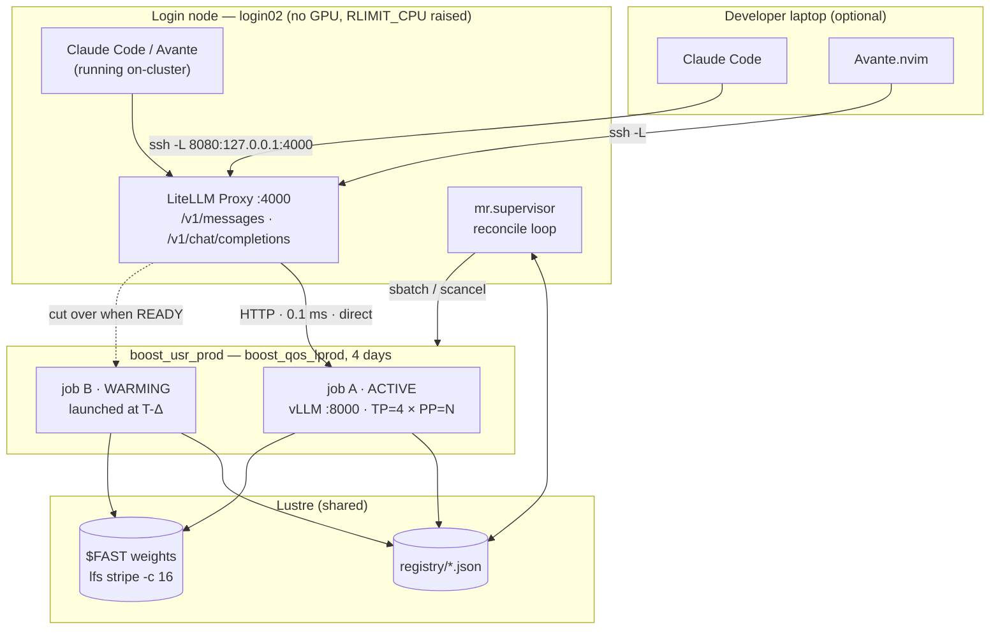

# model-runner — Architecture

An LLM inference service for Leonardo (CINECA), exposing an API that Claude Code and
Avante.nvim can talk to, backed by multi-node vLLM running under Slurm.

---

## 1. Measured environment

Everything below was probed on `login02.leonardo.local` on 2026-08-12, not assumed.
These numbers drive every design decision that follows.

| Property | Measured value | Design consequence |
|---|---|---|
| Partition | `boost_usr_prod`, 3280 nodes | Target partition |
| Node | 4× **A100-SXM-64GB**, compute cap **8.0**, 1×32c Ice Lake, 494 GB RAM | **256 GB HBM/node**; 8 CPU cores per GPU |
| FP8 | **Not available** (needs SM 8.9+) | Never `--kv-cache-dtype fp8`; native-FP8 checkpoints need conversion |
| Interconnect | 2× HDR100 IB (`mlx5_1`, `mlx5_4`) + 25G eth bond | Dual-rail NCCL; must pin `NCCL_IB_HCA` |
| Node-local disk | **None.** `/tmp` is a 10 GB tmpfs; no `/scratch_local` | Weights re-read from Lustre on *every* job start |
| Max walltime | `normal` 24 h · **`boost_qos_lprod` 4 days, ≤8 nodes / 32 GPUs** · `boost_qos_dbg` 30 min | `lprod` is the QoS for a persistent service; **32 GPUs = 2 TB HBM ceiling** |
| **login → compute** | **Direct TCP on arbitrary ports, 0.1 ms RTT** (verified: HTTP 200 to `lrdn2900:8000`) | **No SSH tunnel needed internally.** Login-node component is a plain reverse proxy |
| Login node limits | `RLIMIT_CPU` 600 s **soft / unlimited hard**; RSS 1 GB; 2048 procs | Gateway must `ulimit -t unlimited` at start and stay lightweight |
| Internet | Login: direct (huggingface.co → 200). Compute: none | Weight download is a login-node staging step |
| Container | SingularityPRO 4.3.1 | `.sif` images, `--nv` |
| Site AI modules | cuda 12.2/12.3/12.6, nccl 2.22.3, openmpi — **no vLLM/PyTorch module** | Bring your own container |
| Filesystems | `$HOME` 50 GB (near full) · `$WORK` 1 TB · `$FAST` 1 TB (flash) · `$SCRATCH` (purged) | Weights → `$FAST`; code → `$HOME`/`$WORK`; **never weights in `$HOME`** |
| Budget | `cin_staff` — 864k local-h/month cap, ~10k used this month | Ample, but **shared with the whole staff account**; idle reaping stays on as hygiene |

### The two findings that shape everything

1. **Login nodes reach compute nodes directly on any port.** The "reverse proxy on a login
   node" requirement collapses into a thin HTTP router. No `ssh -R`, no tunnel supervision,
   no port brokering. Verified end to end with a real job.

2. **There is no node-local disk.** A 500 GB checkpoint is read from Lustre on every single
   job start. That cold-start cost — not the walltime limit itself — is what makes naive
   restart-on-expiry unacceptable, and it's what forces the overlapping-handoff design in §4.

---

## 2. Buy vs. build

The project is **glue**, not engine. Almost every hard part already exists.

### Off-the-shelf (do not write these)

| Concern | Choice | Rationale |
|---|---|---|
| Inference engine | **vLLM** (Singularity) | Widest model coverage, Ampere-ready Marlin/AWQ/GPTQ kernels, built-in OpenAI server, mature multi-node. Kept behind an adapter so SGLang can be swapped in — SGLang is materially faster on DeepSeek-class MoE |
| Multi-node bring-up | **`ray symmetric-run`** | Runs one identical entrypoint on every node, mpirun-style; replaces hand-rolled head/worker `srun` choreography. Fallback path kept for older vLLM |
| Container runtime | SingularityPRO 4.3.1 | Site standard, already installed |
| Image build | `singularity build vllm.sif docker://vllm/vllm-openai:<tag>` | Runs on the login node, which has internet |
| **API gateway** | **LiteLLM Proxy** | The keystone: serves `/v1/messages` (Anthropic wire format → Claude Code) *and* `/v1/chat/completions` (OpenAI → Avante) from one process, over the same vLLM backend. Also gives model aliasing, virtual keys, retries, fallbacks |
| Weight staging | `hf download` (huggingface_hub) | Login node only |
| Metrics | vLLM's Prometheus `/metrics` | Already exposed; supervisor scrapes it for idle detection |

### Built here (the actual project)

| Component | Job |
|---|---|
| `mr.registry` | File-based service discovery on Lustre — jobs publish `{node, port, model, state}` |
| `mr.slurm` | Typed wrapper over `sbatch`/`squeue`/`scancel`/`scontrol` |
| `mr.supervisor` | Stateless reconcile loop: keep N healthy backends, pre-launch successors, drain, reap on idle |
| `mr.gateway` | Renders LiteLLM config from the registry, restarts the proxy on change |
| `mrctl` | CLI — `up`, `down`, `status`, `logs`, `models` |
| `slurm/vllm-server.sbatch` | Job template: Singularity + Ray + vLLM + registry heartbeat |

---

## 3. Topology



**Control plane and data plane are separate.** The supervisor never sits in the request
path; if it dies, traffic keeps flowing. The gateway never talks to Slurm; it only reads a
rendered config. Each can be restarted independently.

---

## 4. The walltime problem

This is the heart of the system. Jobs die at 4 days (or earlier, on node failure), and a
cold start costs minutes of Lustre reads.

### Backend state machine

```
QUEUED ──▶ LOADING ──▶ READY ──▶ DRAINING ──▶ GONE
   │           │          │                     ▲
   └───────────┴──────────┴─────────────────────┘
              (any failure → replacement submitted)
```

### Overlapping handoff — zero downtime

```
job A   ├──────────────── serving ───────────────┤ drain ┤
job B                              ├─ queue ─┤ load ├──── serving ────▶
        0                                  T-Δ    T_end
```

1. At `T_end − Δ` the supervisor submits successor **B**. `Δ = measured_load_time × 1.5 +
   queue_margin`. Phase 0 measured a 32B/TP4 load off Lustre at **244s** (job 54085509,
   cold — no page cache, `-c 16 -S 4M` striping). `queue_margin` is still an unmeasured
   guess (~45 min); Phase 3 should log actual `squeue` pending time and tighten it.
   `qwen3-32b.toml` currently sets `handoff_lead_s = 3000` from this.
2. B reaches `READY` (vLLM `/health` + a real completion) → registry updated → gateway
   re-rendered → **new** requests go to B.
3. A → `DRAINING`. When in-flight hits zero (or a 5-minute grace expires) → `scancel A`.
4. Overlap cost: `Δ × nodes`. At 2 nodes × 1 h per 4 days, ≈ 0.5% overhead. Cheap.

### Failure handling

| Failure | Response |
|---|---|
| B still queued when A expires | A serves to the wall; gap covered by gateway `503 + Retry-After`, ETA from `squeue --start` |
| A dies early (`NODE_FAIL`, OOM) | Reconcile loop sees state ≠ RUNNING, submits replacement immediately |
| Supervisor dies | Backends keep serving. On restart it rebuilds state from `squeue` + registry — **stateless reconciliation, not event sourcing** |
| Registry entry stale (job vanished) | Entries carry a heartbeat timestamp; older than 90 s → evicted |

### Idle reaping — budget protection

A continuous 2-node service burns ~192 node-hours (768 GPU-hours) per 4-day job. `cin_staff`
absorbs that comfortably, but it is a *shared* account and an idle model holding 8 A100s is
antisocial regardless of budget. So:

- No request for `idle_timeout` (default 30 min) → `scancel`, desired replicas → 0.
- Next request → gateway returns `503` with a "cold starting, ETA ~Xm" body and the
  supervisor submits a job.
- `mrctl up --pin` disables reaping for a working session.

---

## 5. Model sizing on A100-64GB

Ceiling is **8 nodes × 256 GB = 2048 GB** under `boost_qos_lprod`. Budget roughly
`weights + KV cache + ~10% activations/CUDA graphs`.

- **Parallelism:** TP=4 *within* a node (NVLink), PP *across* nodes (IB). TP across nodes
  works over HDR100 but the all-reduce traffic makes it the wrong default here.
- **KV cache/token** = `2 × layers × kv_heads × head_dim × 2 bytes` (BF16 — no FP8 KV on Ampere).

Approximate BF16 footprints (verify against actual `config.json` before committing nodes):

| Model | ≈ weights | Nodes | Notes |
|---|---|---|---|
| Qwen3-32B | ~65 GB | 1 (TP=4) | Best latency. Good default + `ANTHROPIC_SMALL_FAST_MODEL` |
| Qwen3-235B-A22B | ~470 GB | 3–4 | 2 nodes is too tight once KV is counted |
| Qwen3-Coder-480B-A35B | ~960 GB | 5–6 | **Flagship for Claude Code.** AWQ-INT4 (~240 GB) fits in 2 nodes |
| Kimi K2 (1T) | ~2 TB BF16 | — | **Exceeds the 8-node cap with KV.** Only viable as INT4 (~550 GB, 3 nodes) *if* a community AWQ/GPTQ checkpoint exists. Phase 5 stretch goal, not a Phase 1 target |

> **FP8 caveat.** DeepSeek-V3 and Kimi K2 ship native FP8 checkpoints that A100 cannot
> execute. They must be dequantized to BF16 (doubling size) or re-quantized to AWQ/GPTQ-INT4,
> whose Marlin kernels *do* run on Ampere. Budget a conversion job for these.

---

## 6. Cold start and storage

No local NVMe means Lustre read bandwidth *is* the startup time.

- Stage weights to **`$FAST`** (`/leonardo_scratch/fast/<account>`, flash tier, 1 TB), not `$WORK`.
- `lfs setstripe -c 16 -S 4M` on the model directory **before** downloading → parallel OST reads.
- Load with `--load-format runai_streamer` (or safetensors with a high loader thread count).
- Expect single-digit to ~20 minutes for a 500 GB checkpoint. **Measure it in Phase 0** — this
  number sets `Δ` in §4 and is the single most important unknown left.
- 1 TB of `$FAST` holds roughly one flagship plus one small model → `mrctl models gc` does LRU eviction.

---

## 7. Client wiring

**Claude Code** speaks the Anthropic Messages API and hardcodes the names `sonnet`/`opus`/`haiku`,
so the model must be remapped:

```bash
export ANTHROPIC_BASE_URL=http://127.0.0.1:8080     # ssh -L to LiteLLM
export ANTHROPIC_AUTH_TOKEN=<litellm virtual key>
export ANTHROPIC_MODEL=qwen3-coder-480b
export ANTHROPIC_SMALL_FAST_MODEL=qwen3-32b
```

**Avante.nvim** uses the OpenAI-compatible provider against `http://127.0.0.1:8080/v1`.

**Tool calling is mandatory, not optional.** Claude Code is close to useless without it. vLLM
needs `--enable-auto-tool-choice --tool-call-parser hermes` (Qwen family). Validate tool calls
in Phase 2 before declaring the endpoint usable — this is the most common way a self-hosted
Claude Code setup silently fails.

---

## 8. Phased plan

| Phase | Deliverable | Exit criterion |
|---|---|---|
| **0** | Build `vllm.sif`; stage Qwen3-32B to `$FAST` with striping; run one node by hand | `curl` from login node returns a completion; **load time measured** — **done: 244s (job 54085509)** |
| **1** | `mr.registry` + sbatch template + `mrctl up/status/down` | One model up and discoverable, manual restart |
| **2** | LiteLLM gateway + client wiring | Claude Code completes a real **tool-using** task against the cluster — **done: the actual `claude` CLI (`--bare -p`, `ANTHROPIC_BASE_URL` pointed at the gateway) used its own `Read` tool to fetch a file's real contents end-to-end through vLLM (§9 risks 8, 10–12)** |
| **3** | `mr.supervisor`: rolling handoff + idle reaping | Service survives a walltime expiry with no failed request — **in progress: drain state machine + activity-based idle reaping implemented and unit-tested (`tests/test_supervisor.py`); live-verified a full idle-reap-and-relaunch cycle (§9 risk 13); caught/fixed a real duplicate-launch bug on cold start (§9 risk 14); caught/fixed a schema-forward-compat bug that made a live gateway silently drop a healthy backend (§9 risk 15); live-verified the full drain cycle itself when two backends briefly went READY together -- `start_drain` fired, then the incumbent was cancelled within one tick once `refresh_activity()` saw its in-flight count reach zero, ending in exactly one healthy backend. The only piece still unverified live is *why* a second backend goes READY in the first place via the walltime path specifically (`launch_successor` firing because a job's wall is running out, rather than a manual `mrctl up`) -- that needs a job to actually approach its multi-day wall, which isn't practical to wait out; that trigger condition is covered by the unit tests instead** |
| **4** | Multi-node via `ray symmetric-run`; flagship model; NCCL/IB tuning | 4+ nodes stable under load — **mechanism done: job 54343864, Qwen3-32B deliberately spread TP4/PP4 across 4 real nodes (16 GPUs), `READY after 167s`, 10/10 concurrent requests succeeded (§9 risk 18). Flagship model itself (Qwen3-Coder-480B) not yet attempted — needs more `$FAST` storage or the AWQ-INT4 conversion; NCCL/IB tuning beyond the existing pinned HCAs is untouched, nothing so far has needed it** |
| **5** | Multi-model routing, queue-aware UX, metrics, INT4 conversion for K2-class | — **multi-model routing: done for real, live-verified end to end.** `qwen3-coder-480b-awq` (community AWQ-INT4, ~262 GB) staged, brought up (TP4×PP2, 8 GPUs, `READY after 348s` on the tool-call-fixed run), and now serves Claude Code's real `sonnet` alias through the full stack: real CLI -> gateway -> flagship -> real `Read` tool use -> correct answer. Along the way: fixed a routing bug before it shipped (explicit per-model `role`, §9 risk 20), fixed tool calling that silently returned raw unparsed text instead of structured calls (`qwen3_coder` parser, not `hermes` -- §9 risk 21), and hit the exact stale-long-lived-gateway hazard risk 15 warned about, just failing silently instead of loudly this time (§9 risk 22). Both models run concurrently; Avante.nvim wired up as a second real client (`~/.config/nvim/lua/plugins/avante.lua`). Queue-aware UX, metrics, and K2 INT4 conversion not started |

---

## 9. Open risks

1. **GPU budget — resolved.** Charging to `cin_staff`, which has headroom. Still worth
   confirming the node-hour → local-hour factor before sizing anything long-running, and
   remembering the allocation is shared.
2. **10-day QoS — access being requested.** `qos_vllm` and `qos_llm_prod2` (both 10-day
   walltime) exist, currently scoped to `cin_poc_vllm`. If access lands, raise `time` to
   `10-00:00:00` in the model configs: handoffs drop from every 4 days to every 10, a 2.5×
   reduction in the riskiest recurring operation in the system. Until then, `boost_qos_lprod`
   (4 days) is the target and the handoff machinery is required either way.
3. **`RLIMIT_CPU=600s` on login nodes is sharper than it looks.** Not just a "keep the proxy
   lightweight" hint — it kills *any* login-node process that accumulates 10 minutes of CPU,
   and it does so with misleading errors. It already killed `mksquashfs` mid-way through the
   container build:

   ```
   FATAL: while creating squashfs: create command failed:
          signal: CPU time limit exceeded (core dumped)
   ```

   which reads like a Singularity bug and is not. **Every long-running or CPU-heavy login-node
   entry point must raise the limit explicitly** (`ulimit -t unlimited` in shell,
   `supervisor.raise_cpu_limit()` in Python). The hard limit is unlimited, so this needs no
   privilege. Currently applied in: `scripts/build-container.sh`, `scripts/stage-model.sh`,
   `mr.supervisor.run`, `mr.gateway.run`. Site policy is not a concern here — the operator is a
   site sysadmin — but the kernel limit binds regardless.
4. **Compute → login reachability is untested.** The Lustre-based registry deliberately avoids
   depending on it. Don't introduce a design that needs it without testing first.
5. **Multi-user.** If this serves a team rather than one person, LiteLLM virtual keys cover
   auth and per-user accounting, but fair queueing across users is unsolved here.
6. **`$HOME` is at the 50 GB quota line.** Code only. Any weight, cache or log directory
   (`HF_HOME`, `XDG_CACHE_HOME`, vLLM's torch compile cache) must be redirected off `$HOME`
   or jobs will fail in confusing ways.
7. **Container CUDA version vs. driver — resolved, but will bite again.** Booster's driver is
   R535 (535.274.02), CUDA 12.x generation, with no forward compat to CUDA 13. The plain
   `vllm/vllm-openai:latest`/`vX.Y.Z` Docker tags moved to a CUDA 13.0 base sometime before
   this was written; that build passed the login-node `import torch` sanity check (no GPU
   there to fail on) but died on the compute node at engine init:

   ```
   RuntimeError: The NVIDIA driver on your system is too old (found version 12020).
   ```

   `12020` is `torch`'s encoding of the driver's max supported CUDA (12.2). Fixed by
   building from the `-cu129` tag variant instead (still CUDA 12.x, which NVIDIA's own
   `NVIDIA_REQUIRE_CUDA` image label certifies for driver `>=535,<536`) — same vLLM
   version, different CUDA base. **The login-node sanity check cannot catch this class of
   bug** (no GPU on login nodes), so it's not enough on its own. Now verified with a real
   `torch.cuda.init()` + matmul on `boost_qos_dbg` before trusting a rebuilt container in a
   full job. `scripts/build-container.sh`'s default tag is pinned to a `-cu12x` variant for
   the same reason — **never build from the bare tag**, it will silently drift to whatever
   CUDA major version upstream defaults to next.
8. **LiteLLM config reload — no live path exists, restart instead.** The design originally
   planned to SIGHUP the running proxy so a backend-set change (model up/down, handoff
   cutover) wouldn't drop in-flight requests. Checked against the installed LiteLLM
   (1.98.0): its bare, non-gunicorn server registers no SIGHUP handler at all, so the OS
   default disposition — killing the process outright — would fire instead of any reload.
   The alternative, its `/config/update` admin endpoint, requires a Postgres-backed
   `prisma_client` ("No DB Connected" otherwise), which is a real infra dependency we don't
   want just for this. `mr.gateway` now owns the litellm subprocess directly and does a
   plain terminate-and-relaunch on every config change — a few hundred ms of dropped
   in-flight requests, bounded to exactly the moments the backend set changes, not per
   request. Revisit if LiteLLM ever ships a lighter reload path.
9. **vLLM's automatic KV-cache sizing left ~0 margin against its own CUDA-graph capture
   overhead, and it is not deterministic across nodes.** `gpu_memory_utilization = 0.90`
   ran clean on job 54085509 (node `lrdn3224`) and OOM'd on job 54152253 (node `lrdn2765`,
   identical config, identical A100-64GB hardware): `CUDA out of memory. Tried to allocate
   150.00 MiB. ... 96.50 MiB is free.` vLLM's own log explains why — it reserves only a
   150 MiB buffer past its memory-profiling estimate, and CUDA-graph capture ate exactly
   that on the less-generous node. The log even suggests a fix, but names the wrong flag
   (`--kv-cache-memory=...`) — the real CLI arg, confirmed against `vllm/engine/arg_utils.py`
   inside the container, is `--kv-cache-memory-bytes`. Fixed by pinning
   `qwen3-32b.toml`'s `extra_args` to the conservative value vLLM itself computed
   (`--kv-cache-memory-bytes 38745599181`, its "fit into requested memory" number, not the
   "fully utilize" one that was already failing). **Any new model config needs the same
   treatment**: bring it up once, read the `Free memory on device` log line, and pin the
   byte value rather than trusting `gpu_memory_utilization` alone.
10. **Claude Code resolves model aliases client-side -- `model_alias_map` was dead code.**
    The original design assumed Claude Code sends the literal string `"sonnet"` and LiteLLM's
    `model_alias_map` would catch it. Tested against the real CLI (`--model sonnet`): it
    actually sends `"claude-sonnet-5"` (the full resolved ID), and `model_alias_map` only
    matches exact keys, so every real request 400'd: `Invalid model name passed in
    model=claude-sonnet-5`. Fixed with wildcard `model_list` entries instead
    (`model_name: "claude-*sonnet*"`, etc.) — LiteLLM's own pattern router (`*` → `.*`, matched
    anywhere in the string), which survives future Sonnet/Opus/Haiku snapshots without
    re-pinning exact IDs. `mr.gateway.render()` keeps the bare short forms too, for whatever
    older client sends the literal alias.
11. **Claude Code's default `max_tokens` (64000) exceeds any of our models' context.** vLLM
    400'd: `max_tokens=64000 cannot be greater than max_model_len=32768`. There's no CLI flag
    to lower Claude Code's request-side default, so the fix has to live in the gateway:
    `model_info.max_output_tokens` per deployment (a quarter of the model's `max_model_len`,
    currently 8192) plus `litellm_settings.modify_params: true`, which is what actually makes
    LiteLLM clamp an oversized client `max_tokens` down instead of just describing the model
    for cost tracking. Without `modify_params: true` the `model_info` block is silently inert.
12. **Qwen3's `<think>` block leaked into the visible response text.** Without a reasoning
    parser, vLLM returns the whole `<think>...</think>...answer` blob as ordinary message
    content, so the real Claude Code CLI printed the raw thinking tags inline instead of
    treating them as a separate reasoning section. Fixed with `--reasoning-parser qwen3`
    (`vllm.reasoning.__init__` registers this exact model as `Qwen3ParserReasoningAdapter`
    under the name `"qwen3"`). Confirmed fixed against the real CLI, not just the raw API.
13. **`decide()`'s original idle check used `heartbeat`, which never lets idle reaping fire.**
    The heartbeat subshell refreshes every 30s purely as a liveness signal, independent of
    whether the backend has served a single real request. Fixed with `refresh_activity()`
    (new, `mr.supervisor`), which scrapes each backend's own vLLM `/metrics`
    (`vllm:num_requests_running`, `vllm:num_requests_waiting`,
    `vllm:request_success_total`) and persists `last_active_at` into the registry only when
    it observes actual traffic. `decide()` reads that field, not `heartbeat`, to compute
    idle time -- and stays I/O-free itself, since the scrape is a separate step run once per
    tick before `decide()` is called. **Verified live**: a genuinely idle backend (no request
    in ~97 min) was correctly reaped after exactly one `idle_timeout_s` (30 min) window from
    when monitoring started, and the supervisor then launched a fresh replacement
    automatically -- a full real reap-and-recover cycle with no manual intervention.
14. **First live run of a true cold start (empty registry, nothing running) launched three
    duplicate jobs, one per tick, before this was caught and fixed.** `decide()`'s "pending"
    check was built entirely from *registry* state, but a job has no registry record at all
    until its own script actually starts running and self-publishes -- which can be minutes
    after `sbatch` returns on a busy shared QoS. Every tick during that gap saw "no backend,
    nothing pending" and launched another one. Fixed by sourcing "pending" from *Slurm's*
    live job list minus whatever's already READY/DRAINING in the registry
    (`pending_ids = live - {b.job_id for b in ready + draining}`), which correctly counts a
    job Slurm has accepted but that hasn't self-registered yet. This path was untested until
    Phase 3's first real run because Phases 0-2 always had a backend already up before the
    supervisor ran -- nothing had exercised cold start against a genuinely empty registry
    before. Regression test: `tests/test_supervisor.py::test_freshly_submitted_job_suppresses_duplicate_launch`.
15. **Resolved -- was never heartbeat staleness: a long-lived reader with an old in-memory
    schema silently dropped every registry record a newer writer touched.** First seen as the
    gateway logging `config changed: no backends` against a job Slurm confirmed was healthy
    and `RUNNING` the whole time (initially misdiagnosed as a `STALE_AFTER_S` heartbeat gap --
    a background watcher was even stood up to catch a "recurrence" of the wrong problem).
    Root cause, confirmed directly: `mr.cli gateway` is a long-running process that imports
    `mr.registry` once at startup and keeps that `Backend` class in memory for its whole life.
    Adding `draining_since`/`last_active_at`/`last_activity_count` to `Backend` mid-session,
    while that gateway process (started 19:16, well before the edit) was still running,
    meant `registry.read_all()`'s `Backend(**json.loads(...))` started raising
    `TypeError: unexpected keyword argument 'draining_since'` on every record -- because a
    compute job's heartbeat calls always run *fresh* `python3` invocations that pick up
    whatever's currently on disk, so the job started writing the new schema immediately, long
    before the gateway was ever restarted to match. The broad
    `except (..., TypeError, ...): continue` swallowed it, so every record vanished from the
    gateway's view with no error anywhere -- indistinguishable from staleness unless you
    already suspected a code/data version skew. **This will recur on every real deploy** that
    touches `Backend`'s shape while the gateway or supervisor are running (exactly the
    long-lived-login-process vs. always-fresh-compute-job asymmetry that makes this codebase
    what it is) -- so the fix is structural, not a one-off: `read_all()` now filters incoming
    JSON to known dataclass field names before constructing, so an old reader ignores fields
    it doesn't understand yet instead of dropping the whole record. A genuinely malformed
    record (missing a field with no default) still gets skipped. No code version skew between
    the gateway/supervisor and a running job should ever be able to hide a healthy backend
    again.
16. **`mrctl up` racing a live supervisor is expected, and the system handled it correctly by
    accident.** Ran `mrctl up qwen3-32b` manually moments after the supervisor's own cold-start
    logic had already fired for the same gap (both saw "no backend, none pending" -- neither
    is wrong, they just both reacted to the same true fact before either one's submission
    landed in the other's next read). Result: two backends briefly went READY for a
    `desired=1` model. This is exactly the "successor is ready" case `decide()` already
    handles -- it drained the older one within a tick, no special-casing needed -- but it's
    worth calling out explicitly: **once the supervisor is running, `mrctl up` for manual
    cold-start recovery is redundant and can race it.** Reach for `mrctl up --force` only when
    deliberately adding a second replica or replacing a specific job; otherwise let the
    supervisor own launches.
17. **Idle-reaping saved nothing until desired could actually drop to 0 -- caught as 22
    reap/relaunch cycles overnight.** `cmd_supervise` hardcoded every model's desired replica
    count to 1 forever, so `reap_idle` was immediately undone by a cold-start launch a tick
    later: a full Lustre weight-reload every `idle_timeout_s`, for a GPU allocation that was
    barely ever actually free. Fixed with `mr.demand`, a tiny persisted per-model flag:
    `reap_idle` now clears it (`apply()`), and the supervisor reads it fresh every tick instead
    of a fixed value passed in once at startup. A model with no demand file yet defaults to
    desired=1, preserving prior behavior until the first real idle-reap. `mrctl up`/`mrctl
    down` set it explicitly, matching manual operator intent.

    Bringing it back up needed an actual wake signal, since LiteLLM has no hook back into this
    system when a model has no backend -- it just 404s. `mr.gateway` now renders a `model_list`
    row for a cold model too, pointed at a small local HTTP stub (`_WakerHandler`,
    `127.0.0.1:{WAKER_PORT}/<model>`) instead of a real vLLM URL; hitting it calls
    `demand.wake()` and answers immediately, and the supervisor's next tick (<=60s later) sees
    desired=1 with nothing running and cold-starts it.

    Two more bugs surfaced getting the waker's *response* right, both invisible until tested
    over real HTTP:
    - Not draining the request body before responding risked stalling an HTTP/1.1 client
      mid-connection (`_WakerHandler` now reads and discards it first).
    - **The real one**: an initial 503 response made LiteLLM treat it as a retriable
      `ServiceUnavailableError` -- 2 retries with real backoff, ~90+ seconds of total silence
      before anything reached the client at all, with nothing in LiteLLM's own log until the
      whole retry sequence finished. Switched to 400 (`BadRequestError` to LiteLLM, correctly:
      this isn't a transient infra hiccup to retry, it's "come back later"), which returns to
      the client in under 100ms -- confirmed live, including the full cycle: cold request -> 400
      response -> demand flips to 1 -> supervisor launches -> job reaches READY.

    `tests/test_gateway.py::WakerTest::test_returns_400_not_503` locks this in; it exists
    specifically because the bug was only observable over a real HTTP round-trip, not by
    calling the handler method directly.
18. **Phase 4 kickoff: `ray` was never actually in the container.** `vllm-server.sbatch`'s
    multi-node branch has called `ray symmetric-run` since Phase 0, untested, because nothing
    before Phase 4 ever ran on more than one node. Checked directly: `ray` is not on `PATH` and
    not importable in the upstream `vllm/vllm-openai` image at all -- confirmed empirically, not
    documented anywhere obvious. Three more things had to be fixed to get a real multi-node run
    even queued:
    - **No `--fakeroot` on this system** ("no valid mapping entry found for amonteru" -- no
      subuid/subgid range configured for this user, a site setting). A `.def` file's `%post`
      needs `--fakeroot`/`--remote`/`proot` to run `pip install`, so that path is closed.
      Fixed with the unprivileged alternative: build a writable *sandbox* the same way the bare
      `docker://` pull always worked, `pip install` directly into it, repack to an immutable
      `.sif`. `scripts/build-container.sh` does this now.
    - **A writable sandbox can't auto-create missing bind targets.** A normal (SIF + overlay)
      container run silently creates a missing bind destination; a writable sandbox exec can't,
      and failed with "can't create /leonardo destination automatically without overlay or
      underlay". Fixed by pre-creating Leonardo's top-level mountpoints for real inside the
      sandbox directory before the writable exec.
    - **`-C`/`--containall`, used to dodge the mount error above, was the wrong fix and caused a
      new one**: it swaps in a small tmpfs-backed ephemeral home/tmp instead of the real
      (Lustre-backed) ones, and pip's in-progress download temp file overflowed it --
      `No space left on device`, while `$SCRATCH` itself had petabytes free. Once the mount
      targets were pre-created, `-C` wasn't needed at all; removing it fixed this for good.

    Also fixed while reading `ray symmetric-run --help` for the first time (real output, not
    assumed): `--min-nodes` is not optional in practice. Without it there's no stated guarantee
    the entrypoint waits for every node to actually join the Ray cluster before running --
    vLLM's distributed init needs the full world size present from the start, so
    `vllm-server.sbatch` now passes `--min-nodes ${SLURM_JOB_NUM_NODES}` explicitly.

    Separately (code review, not yet observed as a live failure): the multi-node branch set
    `VLLM_HOST_IP` once in the main script (which runs on the head node) and relied on `srun`
    to propagate it to every worker -- meaning every worker would have advertised the *head's*
    IP as its own. Fixed by resolving it fresh inside a real per-node worker script
    (`${STATE_DIR}/specs/<model>.<jobid>.worker.sh`, written once per job, `srun`'d identically
    on every node) rather than an inline `srun ... $SING ray ...` command, which also sidesteps
    nested-quoting hell across srun/bash/singularity/ray/vllm.

    To validate the mechanism itself without a large new download: `config/models/
    qwen3-32b-4n.toml` deliberately over-provisions the already-staged Qwen3-32B (TP=4, PP=4,
    4 nodes) purely to exercise `ray symmetric-run` + cross-node NCCL/IB + PP end to end. The
    real flagship (Qwen3-Coder-480B-A35B, ~960 GB BF16 per §5) does not currently fit in
    `$FAST`'s 1 TB quota alongside the existing Qwen3-32B weights (939 GB free) -- serving it
    for real needs either more storage or the AWQ-INT4 conversion §5 already flags as a
    separate task, neither of which blocks proving the multi-node mechanism itself.

    First real attempt (job 54342777) got all the way to a fully-formed 4-node Ray cluster
    (head + 3 workers all connected, confirmed in the log) and vLLM starting up, then failed
    at its own config validation: `World size (16) is larger than the number of available GPUs
    (4) in this node. If this is intentional and you are using: ray, set
    '--distributed-executor-backend ray'.` -- vLLM assumes single-node unless told otherwise,
    even with a live multi-node Ray cluster already up underneath it. Also notable: the failed
    run did not exit or free its allocation -- `ray symmetric-run` keeps the cluster alive after
    the entrypoint command crashes ("Running subprocesses are monitored..." per its own log),
    so a crash-looping entrypoint would otherwise burn the full walltime doing nothing. Added
    `--distributed-executor-backend ray` to the multi-node `vllm serve` invocation and
    resubmitted (job 54343864): **`READY after 167s`**, correct rank/PP/TP assignment across
    all 4 nodes in the log (`rank 8 in world size 16 ... PP rank 2, TP rank 0`, etc.), a real
    completion succeeded through the actual TP4/PP4 endpoint
    (`system_fingerprint: vllm-0.27.1-tp4-pp4-...`), and 10/10 concurrent requests succeeded
    (200 OK, ~0.6s each). Phase 4's core mechanism is proven.
19. **`hf download` deterministically failed on one specific file of a large repo, every
    time, via a real `httpx`/`brotlicffi` bug -- not network flakiness.** Staging
    `qwen3-coder-480b-awq` (~262 GB, 65 files) failed twice in a row, both times with
    `httpx.DecodingError: brotli: decoder process called with data when
    'can_accept_more_data()' is False`, both times after all 53 (large) safetensors shards
    had already downloaded successfully. Diffing the expected file list (fetched via the HF
    tree API) against what was actually on disk pinned it to exactly one file:
    `model.safetensors.index.json`, a small (8.2 MB) JSON manifest -- the shard weights
    downloaded fine both times, only this one file's response consistently broke the
    brotli decoder. Retrying the same `hf download` invocation reproduced the identical
    failure rather than succeeding on a different attempt, which is what pointed at a
    deterministic transport bug (specific to how this file's response happens to get
    brotli-encoded/chunked) rather than a transient CDN hiccup. Fixed by fetching that one
    file directly with `curl` instead (a different, unaffected code path), then verifying
    completeness two ways: every file the HF tree API lists is present locally, and every
    shard filename referenced inside the (now-downloaded) index actually exists on disk.
    **If a future large download fails deterministically on retry** (same file, same error,
    not just "some file timed out"), don't just keep retrying the same tool -- diff the
    expected vs. actual file list first, and fetch the specific straggler a different way.
20. **Adding a real second model exposed a routing bug that would have silently misdirected
    Claude Code's traffic.** `mr.gateway.render()` picked the sonnet/opus target as
    `models[0]` (alphabetically first) and the haiku target as whichever model had "32b" in
    its name -- both of which only ever worked because `qwen3-32b` was the sole configured
    model. `"qwen3-32b"` sorts before `"qwen3-coder-480b-awq"` alphabetically, so adding the
    real flagship without fixing this would have kept routing sonnet/opus to the *small*
    model, silently -- no error, just the wrong model serving real requests. Caught by
    inspection while adding the second model, not live. Fixed with an explicit per-model
    `role` field (`"primary"` / `"small"`, `config.ModelSpec.role`) that `render()` checks
    first, falling back to the old heuristic only when nothing sets it (so a pre-existing
    single-model config keeps working unchanged).
    `tests/test_gateway.py::test_primary_role_wins_over_alphabetical_order` locks this in
    with deliberately alphabetically-hostile model names, so a regression here fails loudly
    instead of silently misrouting again.
21. **The flagship's first real bring-up (job 54379904) worked, but tool calling silently
    didn't.** `--tool-call-parser hermes` -- correct for `qwen3-32b`, copied over without
    checking -- doesn't match this model's actual tool-call syntax. A `get_weather` request
    came back with the tool call as *raw unparsed text* in `content`
    (`<tool_call><function=get_weather><parameter=city>Rome</parameter></function>
    </tool_call>`), not a structured `tool_calls` array: no error anywhere, just an unusable
    response, exactly the failure mode architecture.md §7 warns is the most common way a
    self-hosted Claude Code setup silently breaks. Root cause: Qwen3-Coder emits tool calls
    in an XML format hermes doesn't parse. Fixed by checking the container's own tool parser
    registry (`vllm/tool_parsers/__init__.py`) instead of guessing: `qwen3_coder` (alias
    `qwen3_xml`) is the one actually registered for this exact syntax
    (`Qwen3EngineToolParser`, `structural_tag_model = "qwen_3_coder"`). Resubmitted (job
    54381732, `READY after 348s`) and confirmed live: the same request now returns a proper
    `tool_calls` array with correctly parsed arguments and `finish_reason: "tool_calls"`.
    **Lesson: `--tool-call-parser` is per-model-family, not per-vendor** -- "it's a Qwen
    model" was not enough to assume `hermes` would work; check what the model actually
    emits before declaring tool calling functional, the same way max_model_len and
    kv-cache-memory-bytes already get checked against the real checkpoint rather than
    copied from another model's config.
22. **The running gateway silently routed `sonnet` to the wrong model for ~50 minutes after
    the fix that was supposed to prevent exactly that (risk 20) had already landed.** After
    staging and first testing the flagship, `sonnet` was still resolving to `qwen3-32b` --
    not a bug in the fix itself (confirmed correct via `tests/test_gateway.py` and a direct
    headless-Neovim-style check), but because the live `mr.gateway` process had been running
    since 10:52, hours before the `role`-field commit at 14:43. It had the *old* alphabetical
    + `"32b"`-substring logic loaded in memory and no way to know newer code existed on disk.
    This is the same long-lived-process-vs-fresh-code asymmetry as risk 15, but with a
    different failure shape: risk 15 crashed loudly (schema mismatch, `TypeError`), this one
    failed silently (still perfectly valid Python, just stale logic) -- confirmed by checking
    the gateway process's start time against the fix's commit time, then restarting it, after
    which `sonnet` correctly resolved to the flagship immediately. **There is currently no
    mechanism that detects this automatically** -- restarting `mr.cli gateway` (and
    `mr.cli supervise`) after any code change that affects their behavior is a manual step an
    operator has to remember. Worth a real fix later (e.g. a content-hash check that triggers
    a self-restart), but not yet built.
